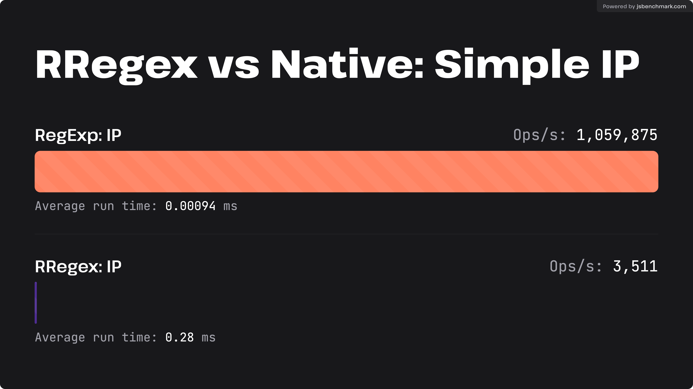
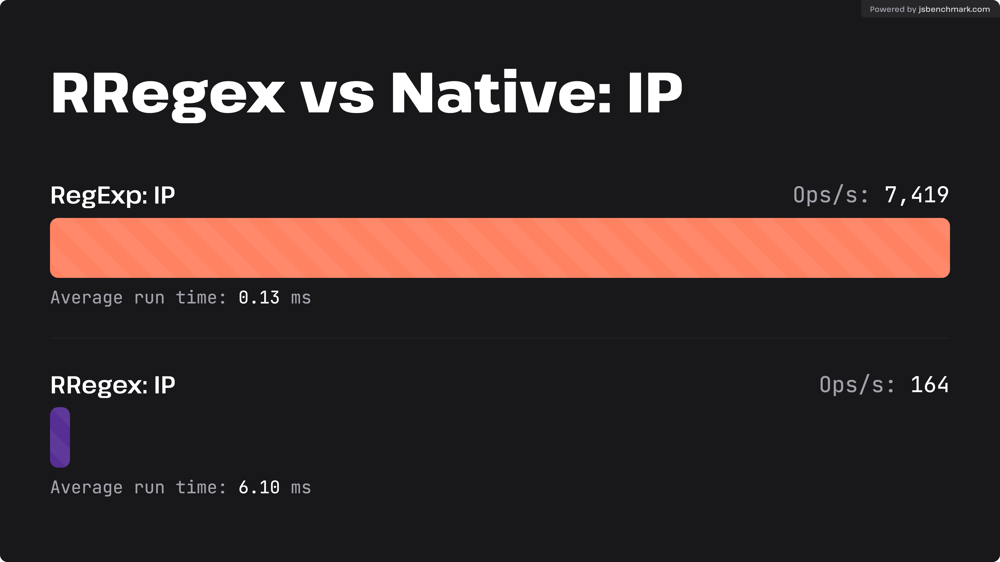
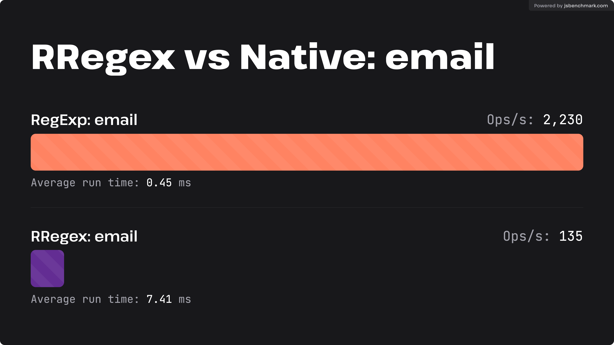
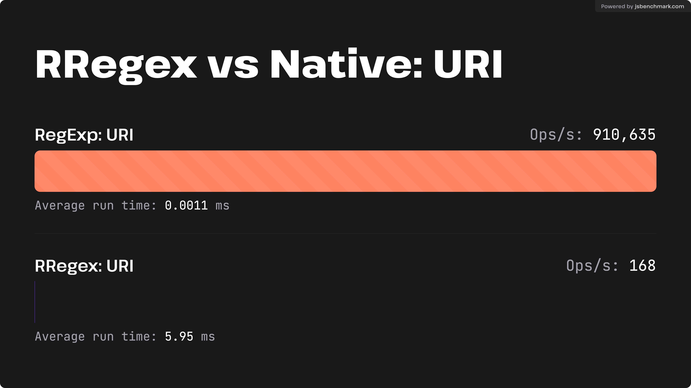

# rregex

A dependency-free WebAssembly build of [Rust Regex](https://docs.rs/regex/latest/regex/) for Javascript

  
[](https://jsr.io/@rregex/rregex)

- [Why Rust Regex](#why-rust-regex)
- [Install](#install)
- [Supported Runtimes](#supported-runtimes)
- [API](https://tsdocs.dev/docs/rregex/latest)
  - [`RRegex`](https://tsdocs.dev/docs/rregex/latest/classes/RRegex.html)
  - [`RRegexSet`](https://tsdocs.dev/docs/rregex/latest/classes/RRegexSet.html)
  - [`Match`](https://tsdocs.dev/docs/rregex/latest/types/Match.html)
  - [`Captures`](https://tsdocs.dev/docs/rregex/latest/types/Captures.html)
  - [`escape`](https://tsdocs.dev/docs/rregex/latest/functions/escape.html)
- [Benchmarks](#benchmarks)
- [Known Issues](#known-issues)

## Why Rust Regex

Rust has a powerful Regex library with a lot of features that don't exists en the standard `Regex` object

[See the official documentation](https://docs.rs/regex/latest/regex/#syntax) for more detail

## Install

```bash
  # NPM
  npm install rregex

  # Yarn
  yarn add rregex

  # PNPM
  pnpm add rregex

  # Deno
  deno add @rregex/rregex

  # JSR
  npx jsr add @rregex/rregex
```

## Supported Runtimes

This package includes builds for multiple runtimes

| Runtime            | Import                                                  | version    |
| ------------------ | ------------------------------------------------------- | ---------- |
| Node.js (esm)      | `import { RRegex, RRegexSet } from 'rregex'`            | `*`        |
| Node.js (commonjs) | `const { RRegex, RRegexSet } = require('rregex')`       | `*`        |
| Deno               | `import { RRegex, RRegexSet } from '@rregex/rregex'`    | `>=1.10.8` |
| Bun                | `import { RRegex, RRegexSet } from '@rregex/rregex'`    | `>=1.10.8` |
| Cloudflare Workers | `import { RRegex, RRegexSet } from 'rregex/lib/cf.mjs'` | `>=1.10.8` |
| Browser            | TODO                                                    |            |
| Standalone         | TODO                                                    |            |

## Benchmarks

In general terms `rregex` is  at least 1 order of magnitud slower than the native `RegExp` object, but still have a good performance. **Unless you required some of the features that `rregex` provides, you should always consider using the native `RegExp` object**

[](https://jsbenchmark.com/#eyJjYXNlcyI6W3siaWQiOiJlZl9VbGJvYThpRGNYeGM3VUl4YnMiLCJjb2RlIjoiREFUQS5tYXRjaCgnKD86KD86MjVbMC01XXwyWzAtNF1bMC05XXxbMDFdP1swLTldWzAtOV0pXFxcXC4pezN9KD86MjVbMC01XXwyWzAtNF1bMC05XXxbMDFdP1swLTldWzAtOV0pJykiLCJkZXBlbmRlbmNpZXMiOltdLCJuYW1lIjoiUmVnRXhwOiBJUCJ9LHsiaWQiOiI0QkxuZmtPd0p4ZTZhQ0NSVmpIOVUiLCJjb2RlIjoibmV3IHJyZWdleC5SUmVnZXgoXCIoPzooPzoyNVswLTVdfDJbMC00XVswLTldfFswMV0_WzAtOV1bMC05XSlcXFxcLil7M30oPzoyNVswLTVdfDJbMC00XVswLTldfFswMV0_WzAtOV1bMC05XSlcIikuZmluZChEQVRBKSIsImRlcGVuZGVuY2llcyI6W10sIm5hbWUiOiJSUmVnZXg6IElQIn1dLCJjb25maWciOnsibmFtZSI6IlJSZWdleCB2cyBOYXRpdmU6IElQIiwicGFyYWxsZWwiOnRydWUsImdsb2JhbFRlc3RDb25maWciOnsiZGVwZW5kZW5jaWVzIjpbeyJ1cmwiOiJodHRwczovL2Nkbi5qc2RlbGl2ci5uZXQvbnBtL3JyZWdleEAxLjEwLjEwL2xpYi93ZWIubWluLmpzIiwibmFtZSI6InJyZWdleCIsImVzbSI6dHJ1ZX1dfSwiZGF0YUNvZGUiOiJjb25zdCB3cmVzID0gYXdhaXQgZmV0Y2goJ2h0dHBzOi8vY2RuLmpzZGVsaXZyLm5ldC9ucG0vcnJlZ2V4QDEuMTAuMTAvbGliL3JyZWdleC53YXNtJylcbmNvbnN0IHcgPSBhd2FpdCB3cmVzLmFycmF5QnVmZmVyKClcbnJyZWdleC5pbml0U3luYyh3KVxuXG5yZXR1cm4gYFxuIyBodHRwczovL3d3dy5jbG91ZGZsYXJlLmNvbS9pcHMtdjQvI1xuMTczLjI0NS40OC4wLzIwXG4xMDMuMjEuMjQ0LjAvMjJcbjEwMy4yMi4yMDAuMC8yMlxuMTAzLjMxLjQuMC8yMlxuMTQxLjEwMS42NC4wLzE4XG4xMDguMTYyLjE5Mi4wLzE4XG4xOTAuOTMuMjQwLjAvMjBcbjE4OC4xMTQuOTYuMC8yMFxuMTk3LjIzNC4yNDAuMC8yMlxuMTk4LjQxLjEyOC4wLzE3XG4xNjIuMTU4LjAuMC8xNVxuMTA0LjE2LjAuMC8xM1xuMTA0LjI0LjAuMC8xNFxuMTcyLjY0LjAuMC8xM1xuMTMxLjAuNzIuMC8yMlxuYCJ9fQ)

[](https://jsbenchmark.com/#eyJjYXNlcyI6W3siaWQiOiJlZl9VbGJvYThpRGNYeGM3VUl4YnMiLCJjb2RlIjoiREFUQS5tYXRjaCgnKD86KD86MjVbMC01XXwyWzAtNF1bMC05XXxbMDFdP1swLTldWzAtOV0pXFxcXC4pezN9KD86MjVbMC01XXwyWzAtNF1bMC05XXxbMDFdP1swLTldWzAtOV0pJykiLCJkZXBlbmRlbmNpZXMiOltdLCJuYW1lIjoiUmVnRXhwOiBVUkkifSx7ImlkIjoiNEJMbmZrT3dKeGU2YUNDUlZqSDlVIiwiY29kZSI6Im5ldyBycmVnZXguUlJlZ2V4KFwiKD86KD86MjVbMC01XXwyWzAtNF1bMC05XXxbMDFdP1swLTldWzAtOV0pXFxcXC4pezN9KD86MjVbMC01XXwyWzAtNF1bMC05XXxbMDFdP1swLTldWzAtOV0pXCIpLmZpbmQoREFUQSkiLCJkZXBlbmRlbmNpZXMiOltdLCJuYW1lIjoiUlJlZ2V4OiBVUkkifV0sImNvbmZpZyI6eyJuYW1lIjoiUlJlZ2V4IHZzIE5hdGl2ZTogSVAiLCJwYXJhbGxlbCI6dHJ1ZSwiZ2xvYmFsVGVzdENvbmZpZyI6eyJkZXBlbmRlbmNpZXMiOlt7InVybCI6Imh0dHBzOi8vY2RuLmpzZGVsaXZyLm5ldC9ucG0vcnJlZ2V4QDEuMTAuMTAvbGliL3dlYi5taW4uanMiLCJuYW1lIjoicnJlZ2V4IiwiZXNtIjp0cnVlfV19LCJkYXRhQ29kZSI6ImNvbnN0IGRyZXMgPSBhd2FpdCBmZXRjaCgnaHR0cHM6Ly9yYXcuZ2l0aHVidXNlcmNvbnRlbnQuY29tL21hcmlvbWthL3JlZ2V4LWJlbmNobWFyay9tYXN0ZXIvaW5wdXQtdGV4dC50eHQnKVxuY29uc3QgZGF0YSA9IGF3YWl0IGRyZXMudGV4dCgpXG5cbmNvbnN0IHdyZXMgPSBhd2FpdCBmZXRjaCgnaHR0cHM6Ly9jZG4uanNkZWxpdnIubmV0L25wbS9ycmVnZXhAMS4xMC4xMC9saWIvcnJlZ2V4Lndhc20nKVxuY29uc3QgdyA9IGF3YWl0IHdyZXMuYXJyYXlCdWZmZXIoKVxucnJlZ2V4LmluaXRTeW5jKHcpXG5cbnJldHVybiBkYXRhLnNsaWNlKDAsIE1hdGguZmxvb3IoZGF0YS5sZW5ndGgvNSkpIn19)

[](https://jsbenchmark.com/#eyJjYXNlcyI6W3siaWQiOiJlZl9VbGJvYThpRGNYeGM3VUl4YnMiLCJjb2RlIjoiREFUQS5tYXRjaCgnW1xcXFx3ListXStAW1xcXFx3Li1dK1xcXFwuW1xcXFx3Li1dKycpIiwiZGVwZW5kZW5jaWVzIjpbXSwibmFtZSI6IlJlZ0V4cDogZW1haWwifSx7ImlkIjoiNEJMbmZrT3dKeGU2YUNDUlZqSDlVIiwiY29kZSI6Im5ldyBycmVnZXguUlJlZ2V4KFwiW1xcXFx3XFxcXC4rLV0rQFtcXFxcd1xcXFwuLV0rXFxcXC5bXFxcXHdcXFxcLi1dK1wiKS5maW5kKERBVEEpIiwiZGVwZW5kZW5jaWVzIjpbXSwibmFtZSI6IlJSZWdleDogZW1haWwifV0sImNvbmZpZyI6eyJuYW1lIjoiUlJlZ2V4IHZzIE5hdGl2ZTogZW1haWwiLCJwYXJhbGxlbCI6dHJ1ZSwiZ2xvYmFsVGVzdENvbmZpZyI6eyJkZXBlbmRlbmNpZXMiOlt7InVybCI6Imh0dHBzOi8vY2RuLmpzZGVsaXZyLm5ldC9ucG0vcnJlZ2V4QDEuMTAuMTAvbGliL3dlYi5taW4uanMiLCJuYW1lIjoicnJlZ2V4IiwiZXNtIjp0cnVlfV19LCJkYXRhQ29kZSI6ImNvbnN0IGRyZXMgPSBhd2FpdCBmZXRjaCgnaHR0cHM6Ly9yYXcuZ2l0aHVidXNlcmNvbnRlbnQuY29tL21hcmlvbWthL3JlZ2V4LWJlbmNobWFyay9tYXN0ZXIvaW5wdXQtdGV4dC50eHQnKVxuY29uc3QgZGF0YSA9IGF3YWl0IGRyZXMudGV4dCgpXG5cbmNvbnN0IHdyZXMgPSBhd2FpdCBmZXRjaCgnaHR0cHM6Ly9jZG4uanNkZWxpdnIubmV0L25wbS9ycmVnZXhAMS4xMC4xMC9saWIvcnJlZ2V4Lndhc20nKVxuY29uc3QgdyA9IGF3YWl0IHdyZXMuYXJyYXlCdWZmZXIoKVxucnJlZ2V4LmluaXRTeW5jKHcpXG5cbnJldHVybiBkYXRhLnNsaWNlKDAsIE1hdGguZmxvb3IoZGF0YS5sZW5ndGgvNSkpIn19)

[](https://jsbenchmark.com/#eyJjYXNlcyI6W3siaWQiOiJlZl9VbGJvYThpRGNYeGM3VUl4YnMiLCJjb2RlIjoiREFUQS5tYXRjaCgnW1xcXFx3XSs6XFxcXC9cXFxcL1teXFxcXC9cXFxccz8jXStbXlxcXFxzPyNdKyg_OlxcXFw_W15cXFxccyNdKik_KD86I1teXFxcXHNdKik_JykiLCJkZXBlbmRlbmNpZXMiOltdLCJuYW1lIjoiUmVnRXhwOiBVUkkifSx7ImlkIjoiNEJMbmZrT3dKeGU2YUNDUlZqSDlVIiwiY29kZSI6Im5ldyBycmVnZXguUlJlZ2V4KFwiW1xcXFx3XSs6Ly9bXi9cXFxccz8jXStbXlxcXFxzPyNdKyg_OlxcXFw_W15cXFxccyNdKik_KD86I1teXFxcXHNdKik_XCIpLmZpbmQoREFUQSkiLCJkZXBlbmRlbmNpZXMiOltdLCJuYW1lIjoiUlJlZ2V4OiBVUkkifV0sImNvbmZpZyI6eyJuYW1lIjoiUlJlZ2V4IHZzIE5hdGl2ZTogVVJJIiwicGFyYWxsZWwiOnRydWUsImdsb2JhbFRlc3RDb25maWciOnsiZGVwZW5kZW5jaWVzIjpbeyJ1cmwiOiJodHRwczovL2Nkbi5qc2RlbGl2ci5uZXQvbnBtL3JyZWdleEAxLjEwLjEwL2xpYi93ZWIubWluLmpzIiwibmFtZSI6InJyZWdleCIsImVzbSI6dHJ1ZX1dfSwiZGF0YUNvZGUiOiJjb25zdCBkcmVzID0gYXdhaXQgZmV0Y2goJ2h0dHBzOi8vcmF3LmdpdGh1YnVzZXJjb250ZW50LmNvbS9tYXJpb21rYS9yZWdleC1iZW5jaG1hcmsvbWFzdGVyL2lucHV0LXRleHQudHh0JylcbmNvbnN0IGRhdGEgPSBhd2FpdCBkcmVzLnRleHQoKVxuXG5jb25zdCB3cmVzID0gYXdhaXQgZmV0Y2goJ2h0dHBzOi8vY2RuLmpzZGVsaXZyLm5ldC9ucG0vcnJlZ2V4QDEuMTAuMTAvbGliL3JyZWdleC53YXNtJylcbmNvbnN0IHcgPSBhd2FpdCB3cmVzLmFycmF5QnVmZmVyKClcbnJyZWdleC5pbml0U3luYyh3KVxuXG5yZXR1cm4gZGF0YS5zbGljZSgwLCBNYXRoLmZsb29yKGRhdGEubGVuZ3RoLzUpKSJ9fQ)

> **Note:** In order to compare with native regex these benchmarks follow the [`mariomka/regex-benchmark`](https://github.com/mariomka/regex-benchmark) structure

## Known Issues

If you call `splitn(text, limit)` and the expected result length is equal to `limit - 1` the result will include an extra item `""`, this behavior does not happen if `limit` es greater. **`fixed at >=1.3`**

```ts
const regex = new RRegex(",");
expect(regex.splitn("a,b,c", 0)).toEqual([]);
expect(regex.splitn("a,b,c", 1)).toEqual(["a,b,c"]);
expect(regex.splitn("a,b,c", 2)).toEqual(["a", "b,c"]);
expect(regex.splitn("a,b,c", 3)).toEqual(["a", "b", "c"]);

// This result includes an unexpected extra item
expect(regex.splitn("a,b,c", 4)).toEqual(["a", "b", "c", ""]);
expect(regex.splitn("a,b,c", 5)).toEqual(["a", "b", "c"]);

expect(regex.splitn("abc", 0)).toEqual([]);
expect(regex.splitn("abc", 1)).toEqual(["abc"]);

// This result includes an unexpected extra item
expect(regex.splitn("abc", 2)).toEqual(["abc", ""]);
expect(regex.splitn("abc", 3)).toEqual(["abc"]);
```
